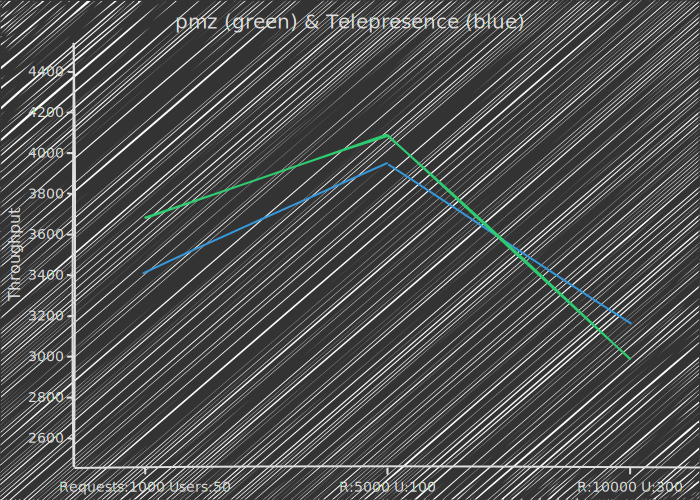

# pmz

Panmunzom (pmz) enables access to Kubernetes services directly using their service domain,
such as `name.namespace.svc`, from your local machine.

## Motivation

While exploring Telepresence, I was impressed by its powerful features, but certain aspects left me wanting more.

- Specifically, I found it limiting to only be able to invoke services using their service domain.
- Additionally, the personal intercept feature, which I found quite valuable, was exclusively available in the paid subscription model.

As a result, I was inspired to design and implement a new tool that could offer these capabilities.

My initial goal was to achieve performance comparable to Telepresence.
Below is a simple throughput comparison of these tools under identical load conditions:



However, it's important to note that `pmz` does not yet match the versatility and stability of Telepresence.
It is currently limited to Linux operating systems and, as an early-stage project, may encounter various issues.

## Features

pmz is being developed to provide a convenient way to access workloads on a Kubernetes cluster from your local machine.

Here are the features currently planned for pmz:

### Local access to workloads using Kubernetes service FQDNs

Access cluster workloads seamlessly using their fully qualified domain names from your local environment.

```sh
> k get po,svc
NAME                             READY   STATUS    RESTARTS         AGE
pod/echo                         1/1     Running   18 (4d19h ago)   28d
pod/pmz-agent-6ff4bfcc8f-qf9st   1/1     Running   0                3d23h

NAME                 TYPE        CLUSTER-IP    EXTERNAL-IP   PORT(S)   AGE
service/echo         ClusterIP   10.96.25.30   <none>        80/TCP    28d
service/kubernetes   ClusterIP   10.96.0.1     <none>        443/TCP   35d

> curl -v "echo.default.svc:80/?echo_body=amazing"
* Could not resolve host: echo.default.svc
* Closing connection
curl: (6) Could not resolve host: echo.default.svc

> pmzctl connect
200 OK: Connected

> curl "echo.default.svc:80/?echo_body=amazing"
HTTP/1.1 200 OK
Content-Type: application/json; charset=utf-8
Content-Length: 9
ETag: W/"9-9C3TDmXfhoWPizWzjFyCX+fxVeQ"
Date: Fri, 17 Jan 2025 12:01:07 GMT
Connection: keep-alive
Keep-Alive: timeout=5

"amazing"⏎
```

### Custom domain routing

Configure custom domains to route to specific workloads, giving you flexibility and control over access.

```sh
> pmzctl connect
200 OK: Connected

> k get svc
NAME         TYPE        CLUSTER-IP    EXTERNAL-IP   PORT(S)   AGE
echo         ClusterIP   10.96.25.30   <none>        80/TCP    28d
kubernetes   ClusterIP   10.96.0.1     <none>        443/TCP   35d

> pmzctl dns list
200 OK:
echo.default.svc 10.96.25.30
kube-dns.kube-system.svc 10.96.0.10
kubernetes.default.svc 10.96.0.1

> pmzctl dns add --domain www.dns.com --service echo --namespace default
200 OK: dns added

> pmzctl dns list
200 OK:
www.dns.com 10.96.25.30
echo.default.svc 10.96.25.30
kube-dns.kube-system.svc 10.96.0.10
kubernetes.default.svc 10.96.0.1

> curl "www.dns.com:80/?echo_body=dns"
HTTP/1.1 200 OK
Content-Type: application/json; charset=utf-8
Content-Length: 5
ETag: W/"5-G/nd3qlVXee5I7QjY2ztXyFnD1E"
Date: Fri, 17 Jan 2025 12:03:42 GMT
Connection: keep-alive
Keep-Alive: timeout=5

"dns"⏎

> pmzctl dns remove --domain www.dns.com
200 OK: dns removed

> pmzctl dns list
200 OK:
echo.default.svc 10.96.25.30
kube-dns.kube-system.svc 10.96.0.10
kubernetes.default.svc 10.96.0.1
```

### Sidecarless interception

Intercept requests to specific Kubernetes workloads locally without requiring pod restarts or sidecar injection.

Identify the target workload for traffic interception (e.g., the `echo` pod).

```sh
> k get svc,po
NAME                 TYPE        CLUSTER-IP      EXTERNAL-IP   PORT(S)              AGE
service/echo         ClusterIP   10.96.246.136   <none>        80/TCP               4m48s
service/kubernetes   ClusterIP   10.96.0.1       <none>        443/TCP              5d11h
service/pmz-agent    ClusterIP   10.96.9.34      <none>        8101/TCP,50018/TCP   96s

NAME                             READY   STATUS    RESTARTS   AGE
pod/echo                         1/1     Running   0          4m48s
pod/pmz-agent-5b88656c74-mjp7s   1/1     Running   0          96s
pod/pmz-cni-z4z6f                1/1     Running   0          96s
```

Start your local process to handle the intercepted requests.

```sh
> docker run -d -p 8081:80 ealen/echo-server
f23ba541dc7b27293a3afc2da0f3ecb64a80180a7aac9bfb5bbaf49cdd9ff564
```

Apply an intercept rule with the `pmzctl intercept` command, then call the service via its FQDN.

```sh
> pmzctl intercept add -s echo -p 8081:80
[DEBUG pmzctl] pmzctl intercept add
200 OK: intercept request processed successfully

> curl "echo.default.svc:80/?echo_body=amazing"
"amazing"⏎
```

Verify the intercept is working by checking the logs of your local process after a successful request.

```sh
> docker logs -f f23b
Listening on port 80.
{
  "name":"echo-server","hostname":"f23ba541dc7b","pid":1,"level":30,
  "host":{"hostname":"echo.default.svc","ip":"::ffff:172.17.0.1","ips":[]},
  "http":{"method":"GET","baseUrl":"","originalUrl":"/?echo_body=amazing","protocol":"http"},
  "request":{"params":{},"query":{"echo_body":"amazing"},
  "cookies":{},
  "body":{},
  "headers":{"host":"echo.default.svc","user-agent":"curl/8.15.0","accept":"*/*"}},
  "environment":{"PATH":"/usr/local/sbin:/usr/local/bin:/usr/sbin:/usr/bin:/sbin:/bin","HOSTNAME":"f23ba541dc7b","NODE_VERSION":"20.11.0","YARN_VERSION":"1.22.19","HOME":"/root"},
  "msg":"Thu, 04 Sep 2025 14:20:11 GMT | [GET] - http://echo.default.svc/?echo_body=amazing","time":"2025-09-04T14:20:11.381Z","v":0
}
```

### Domain-based personal intercepts

Enable personal intercepts based on domain names rather than relying on header-based routing, providing a more streamlined and user-friendly experience. (Not implemented yet)

### Multi-cluster support

`pmz` is planned to support connections to multiple clusters, if feasible.

### Supported protocols

Both TCP and UDP are supported.

## Architecture


## Getting Started

### Prerequisites

`pmz` utilizes eBPF, requiring the following system specifications:

- **Linux Kernel**: 5.4 or higher
- **Supported Architectures**:
  - `amd64` (`x86_64`)
  - `arm64` (`aarch64`)

### Installation

Download and extract the appropriate release for your local machine:

```sh
# x86_64 or aarch64
export ARCH=$(uname -m)
curl -OL https://github.com/wqld/pmz/releases/download/v0.1.8/pmz-0.1.8-${ARCH}-musl.tar.gz
tar -xf pmz-0.1.8-${ARCH}-musl.tar.gz
```

Don't be alarmed if you encounter messages like the following during extraction.
This is because the archive was created on macOS.
A different method will be used for future releases:

- `tar: Ignoring unknown extended header keyword 'LIBARCHIVE.xattr.com.apple.provenance'`

### Usage

First, let's start the `pmz-daemon`.
Since `pmz` uses eBPF, you need to specify your local machine's network interface so it knows where to load the eBPF program:

```sh
> pmzctl run --interface eth0
Running..
```

Next, open a new shell and deploy the `pmz-agent` to your Kubernetes cluster:

```sh
> pmzctl agent deploy
200 OK: Agent deployed
```

After that, establish a tunnel between your local machine and the cluster:

```sh
> pmzctl connect
200 OK: Connected

> pmzctl dns list
200 OK:
kube-dns.kube-system.svc 10.96.0.10
echo.default.svc 10.96.25.30
kubernetes.default.svc 10.96.0.1
```

Now, you can freely access workloads in the cluster from your local machine using their domain names!

```sh
> curl "http://echo.default.svc/?echo_body=amazing"
HTTP/1.1 200 OK
Content-Type: application/json; charset=utf-8
Content-Length: 9
ETag: W/"9-9C3TDmXfhoWPizWzjFyCX+fxVeQ"
Date: Fri, 17 Jan 2025 12:01:07 GMT
Connection: keep-alive
Keep-Alive: timeout=5

"amazing"⏎
```
