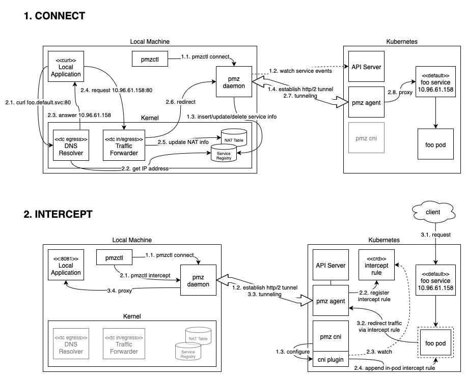

# pmz

Panmunzom (pmz) enables access to Kubernetes services directly using their service domain,
such as `name.namespace.svc`, from your local machine.

## Feature Scope

pmz is being developed to provide a convenient way to access workloads on a Kubernetes cluster from your local machine.

Here are the features currently planned for pmz:

### Local access to workloads using Kubernetes service FQDNs

Access cluster workloads seamlessly using their fully qualified domain names from your local environment. (implemented)

```sh
> k get po,svc
NAME                             READY   STATUS    RESTARTS         AGE
pod/echo                         1/1     Running   18 (4d19h ago)   28d
pod/pmz-agent-6ff4bfcc8f-qf9st   1/1     Running   0                3d23h

NAME                 TYPE        CLUSTER-IP    EXTERNAL-IP   PORT(S)   AGE
service/echo         ClusterIP   10.96.25.30   <none>        80/TCP    28d
service/kubernetes   ClusterIP   10.96.0.1     <none>        443/TCP   35d

> curl -v "echo.default.svc:80/?echo_body=amazing"
* Could not resolve host: echo.default.svc
* Closing connection
curl: (6) Could not resolve host: echo.default.svc

> pmzctl connect
200 OK: Connected

> curl "echo.default.svc:80/?echo_body=amazing"
HTTP/1.1 200 OK
Content-Type: application/json; charset=utf-8
Content-Length: 9
ETag: W/"9-9C3TDmXfhoWPizWzjFyCX+fxVeQ"
Date: Fri, 17 Jan 2025 12:01:07 GMT
Connection: keep-alive
Keep-Alive: timeout=5

"amazing"⏎
```

### Custom domain routing

Configure custom domains to route to specific workloads, giving you flexibility and control over access. (implemented)

```sh
> pmzctl connect
200 OK: Connected

> k get svc
NAME         TYPE        CLUSTER-IP    EXTERNAL-IP   PORT(S)   AGE
echo         ClusterIP   10.96.25.30   <none>        80/TCP    28d
kubernetes   ClusterIP   10.96.0.1     <none>        443/TCP   35d

> pmzctl dns list
200 OK:
echo.default.svc 10.96.25.30
kube-dns.kube-system.svc 10.96.0.10
kubernetes.default.svc 10.96.0.1

> pmzctl dns add --domain www.dns.com --service echo --namespace default
200 OK: dns added

> pmzctl dns list
200 OK:
www.dns.com 10.96.25.30
echo.default.svc 10.96.25.30
kube-dns.kube-system.svc 10.96.0.10
kubernetes.default.svc 10.96.0.1

> curl "www.dns.com:80/?echo_body=dns"
HTTP/1.1 200 OK
Content-Type: application/json; charset=utf-8
Content-Length: 5
ETag: W/"5-G/nd3qlVXee5I7QjY2ztXyFnD1E"
Date: Fri, 17 Jan 2025 12:03:42 GMT
Connection: keep-alive
Keep-Alive: timeout=5

"dns"⏎

> pmzctl dns remove --domain www.dns.com
200 OK: dns removed

> pmzctl dns list
200 OK:
echo.default.svc 10.96.25.30
kube-dns.kube-system.svc 10.96.0.10
kubernetes.default.svc 10.96.0.1
```

### Sidecarless interception

Intercept requests to specific Kubernetes workloads locally without requiring pod restarts or sidecar injection.

### Domain-based personal intercepts

Enable personal intercepts based on domain names rather than relying on header-based routing, providing a more streamlined and user-friendly experience.

## Architecture


